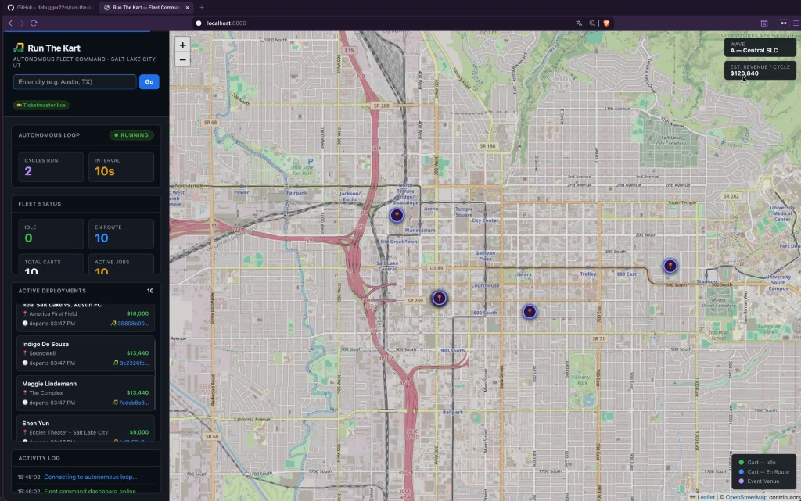

# 🛺 Run The Kart

**Autonomous food truck fleet management powered by Claude AI agents.**

Deploy a fleet of food trucks to the highest-value events in any US city — fully autonomously, with zero human input after startup.



---

## How It Works

Every 10 seconds, three AI agents collaborate to manage the fleet:

### 1. Event Agent
Calls the **Ticketmaster Discovery API** to find real events happening near the operating city. Scores each event using a demand forecasting model:
- **Demand score** — estimated customers/hour based on attendance × category conversion rate (sports: 10%, festivals: 15%, etc.)
- **Opportunity score** — demand score + time-of-day bonus + duration + revenue potential, capped at 100
- Drops events scoring below 40

### 2. Scheduler Agent (Claude — reasoning only)
Receives the scored event list and all idle cart positions. In a **single LLM call** it:
- Assigns the nearest idle cart to each high-value event
- Enforces geographic spread — no clustering all carts at one venue
- Prevents double-booking — each cart_id appears at most once
- Allows 2 carts at venues with attendance > 5,000
- Estimates revenue per assignment: `attendance × conversion_rate × avg_order_value`

### 3. Orchestrator
- Auto-expires schedules when `departure_time` passes → carts return to idle automatically
- Pins search centre to the selected city (overrides fleet centroid)
- Fires an immediate cycle on city change — no waiting for the loop timer
- Runs continuously on a 10-second interval with no human input

---

## Autonomous Workflow (per cycle)

```
Boot
 └─ Autonomous loop starts (10s interval)
      └─ Every tick:
           1. Expire finished schedules → carts go idle
           2. Resolve search centre (city override > fleet centroid)
           3. EventAgent → Ticketmaster API → score + rank events
           4. SchedulerAgent → Claude LLM → assign idle carts to events
           5. Apply assignments → carts go en_route
           6. Sleep 10s → repeat
```

---

## Architecture

```
                    ┌──────────────────────┐
                    │   OrchestratorAgent  │  ← runs every 10s, no human input
                    │   + AutonomousLoop   │
                    └────────┬─────────────┘
                             │
               ┌─────────────┴─────────────┐
               ▼                           ▼
   ┌───────────────────┐       ┌───────────────────────┐
   │    EventAgent     │       │    SchedulerAgent     │
   │  Ticketmaster API │──────▶│  Claude (reasoning)   │
   │  + demand scoring │       │  revenue optimisation │
   └───────────────────┘       └───────────────────────┘
         Skills                       Skills
   DemandForecastingSkill       FleetOptimizationSkill
```

### Key classes

| Class | File | Description |
|---|---|---|
| `Cart` | `src/models/cart.py` | Single food truck — status, GPS, assignment |
| `Fleet` | `src/models/fleet.py` | Manages the cart collection |
| `Schedule` | `src/models/schedule.py` | Cart-to-event assignment with timing + revenue |
| `EventAgent` | `src/agents/event_agent.py` | Discovers and scores events via Ticketmaster |
| `SchedulerAgent` | `src/agents/scheduler_agent.py` | Assigns carts via Claude (one-shot JSON) |
| `OrchestratorAgent` | `src/agents/orchestrator.py` | Coordinates both agents, manages fleet state |
| `AutonomousLoop` | `src/api/loop.py` | Background asyncio task — runs every N seconds |

---

## Setup

```bash
# 1. Clone and create virtual environment
git clone https://github.com/debugger22m/run-the-kart.git
cd run-the-kart
python3 -m venv .venv
source .venv/bin/activate

# 2. Install dependencies
pip install -r requirements.txt

# 3. Configure environment
cp .env.example .env
```

Edit `.env`:

```env
ANTHROPIC_API_KEY=sk-ant-...          # Required — get at console.anthropic.com

TICKETMASTER_API_KEY=...              # Optional — free at developer.ticketmaster.com
                                      # Without this, rotating SLC mock events are used

LOOP_INTERVAL_SECONDS=10             # How often the autonomous loop fires
DEMO_EXPIRE_SECS=45                  # Schedules expire after N seconds (demo mode)
DEFAULT_FLEET_NAME=KartFleet
LOG_LEVEL=INFO
```

## Running

```bash
source .venv/bin/activate
python3 start.sh
```

Open **http://localhost:8000** — the autonomous loop starts immediately.

---

## Live Dashboard

- **Map** (Leaflet + OpenStreetMap) — cart markers update every 5s
  - 🟢 Green pulse = idle, awaiting assignment
  - 🔵 Blue = en route to an event
  - 🟣 Purple = event venue
- **City search** — type any US city, hit Go. Fleet relocates and pulls live events immediately.
- **Activity log** — real-time cycle events, deployments, expiries
- **Loop status** — cycle count, interval, last run
- **Revenue estimate** — projected earnings across all active deployments

---

## API Reference

| Method | Path | Description |
|---|---|---|
| `GET` | `/` | Live dashboard UI |
| `GET` | `/api/v1/dashboard` | All UI data in one call |
| `POST` | `/api/v1/city` | Change city, reposition fleet, trigger immediate cycle |
| `GET` | `/api/v1/fleet` | Fleet overview + loop status |
| `GET` | `/api/v1/fleet/carts` | All carts |
| `POST` | `/api/v1/fleet/carts` | Add a cart |
| `GET` | `/api/v1/schedules` | Active deployments |
| `POST` | `/api/v1/schedules/complete` | Manually complete a schedule |
| `POST` | `/api/v1/orchestrate` | Trigger a single cycle manually |
| `POST` | `/api/v1/autonomous/start` | Start the loop (auto-starts on boot) |
| `POST` | `/api/v1/autonomous/stop` | Stop the loop |
| `GET` | `/api/v1/autonomous/status` | Loop status + cycle history |

---

## Project Structure

```
run-the-kart/
├── start.sh                     # Server entry point (loads .env + starts uvicorn)
├── main.py                      # CLI entry point
├── requirements.txt
├── Procfile                     # For Railway / Heroku deployment
├── ui/
│   └── index.html               # Single-page live dashboard
└── src/
    ├── agents/
    │   ├── base.py              # Agentic loop (tool-use, skill routing)
    │   ├── orchestrator.py      # Top-level coordinator + autonomous loop
    │   ├── event_agent.py       # Event discovery + demand scoring
    │   └── scheduler_agent.py   # Revenue-optimised cart assignment
    ├── models/
    │   ├── cart.py              # Cart, CartStatus, Coordinates
    │   ├── fleet.py             # Fleet
    │   └── schedule.py          # Schedule, Event, ScheduleStatus
    ├── tools/
    │   ├── event_tools.py       # Ticketmaster API + mock fallback
    │   └── maps_tools.py        # Haversine routing (swap for Google Maps)
    ├── skills/
    │   ├── demand_forecasting.py
    │   └── fleet_optimization.py
    └── api/
        ├── app.py               # FastAPI factory + lifespan (auto-starts loop)
        ├── state.py             # Shared state (fleet + orchestrator)
        ├── loop.py              # AutonomousLoop background task
        └── routes.py            # All REST endpoints
```

---

## Deployment (Railway — free)

1. Push to GitHub
2. Go to [railway.app](https://railway.app) → New Project → Deploy from GitHub
3. Set env vars: `ANTHROPIC_API_KEY`, `TICKETMASTER_API_KEY`, `DEMO_EXPIRE_SECS=45`
4. Start command: `python3 start.sh`
5. Railway provides a public URL automatically
